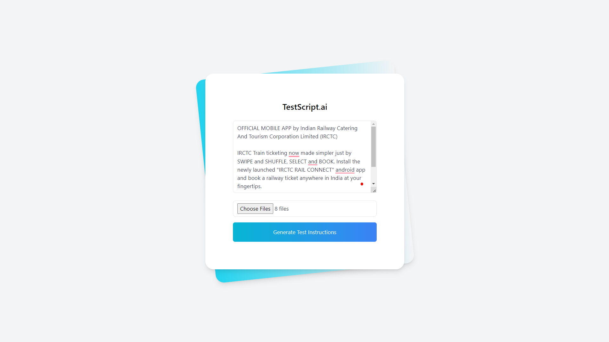
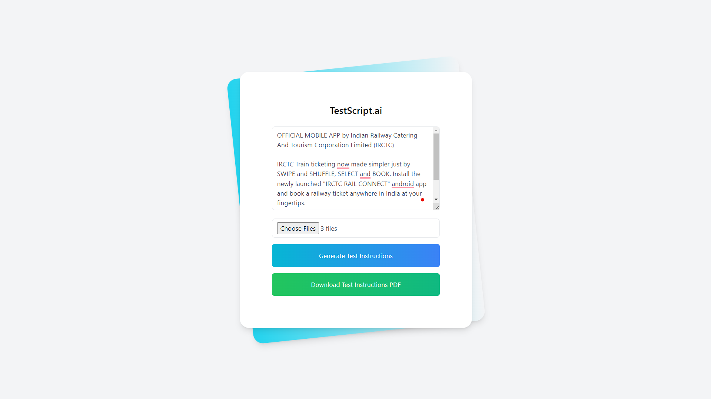

# TestScript.ai

*Tired of manual test script creation?*

**TestScript is your solution.**

Simply upload screenshots and provide context, and our AI will generate detailed test cases. 

- Improve testing efficiency, 
- reduce errors, and 
- ensure product quality 

with TestScript.ai

### Features:
- Upload screenshots and enter context (e.g., app functionality, details).
- Automatically generate test cases.
- Download generated test cases in PDF format.
- Verify results with detailed steps and handle test data with varying inputs.
- Error handling and feedback for invalid inputs.

---

## Table of Contents

1. [TestScript.ai-Demo](#TestScript.ai-Demo)
2. [Frontend (React.js)](#frontend-setup)
3. [Backend (Python - FastAPI)](#backend-setup)
4. [PDF Download Feature](#pdf-download-feature)
5. [Usage](#usage)
6. [Testing and Output](#testing-and-output)

---

## TestScript.ai-Demo

### 1. **Home Screen**

This is where users can upload images of the app and enter relevant context information.



### 2. **Generated Test Case Screen**

Once the test case is generated, it will be displayed here. Users can also download the test case in PDF format.



### 3. **Generated Test Case PDF**

View the generated test cases pdf here

[Generated Test Case pdf](./tests/results/test_instructions.pdf)


## Frontend Setup (React.js)

### Prerequisites
- Node.js (v16 or above)
- npm or yarn

### Steps

1. **Clone the repository:**

    ```bash
    git clone https://github.com/auth-02/testscript.ai.git
    cd testscript.ai-frontend
    ```

2. **Install dependencies:**

    Using npm:

    ```bash
    npm install
    ```

    Or using yarn:

    ```bash
    yarn install
    ```

3. **Run the development server:**

    ```bash
    npm start
    ```

    The frontend will be available at `http://localhost:3000`.


## Backend Setup (FastAPI)

### Prerequisites
- Python 3.9+
- FastAPI
- Uvicorn (ASGI server)

### Steps

1. **Clone the backend repository:**

    ```bash
    git clone https://github.com/auth-02/testscript.ai.git
    cd testscript.ai-backend
    ```

2. **Set up a virtual environment:**

    ```bash
    python -m venv venv
    source venv/bin/activate    # On Windows: venv\Scripts\activate
    ```

3. **Install the required Python packages:**

    ```bash
    pip install -r requirements.txt
    ```

4. **Run the FastAPI backend server:**

    ```bash
    uvicorn main:app --reload
    ```

    The API will be available at `http://localhost:8000`.

---

## PDF Download Feature

The application includes a feature to **generate and download structured test cases as a PDF**. Here's how it works:

1. **User Input**: The user uploads screenshots and provides the optional context
2. **Test Case Generation**: The backend processes the input and generates a test case. This test case is structured as:
   - **Test Case ID**: A unique identifier for each test case.
   - **Test Case Title**: A descriptive title summarizing the test case.
   - **Description**: Detailed explanation of the test scenario.
   - **Preconditions**: Any conditions that must be met before executing the test.
   - **Test Steps**: Step-by-step instructions for performing the test.
   - **Expected Results**: What should happen if the test passes.
   - **Actual Results**: What happens during testing (for manual or automated checks).
   - **Test Data**: Input data used in the test (e.g., source, destination, travel date).
   - **Notes**: Additional information or edge cases to test.

3. **Download PDF**: After generation, the test case can be downloaded in PDF format.


### Example Test Case Template:

refer [Template](./template.txt) for detailed format


## Usage

1. **Upload Screenshots and Enter Context**: Go to the homepage and upload screenshots of the mobile app interface. Fill in optional context details what this screenshot are about.
2. **Generate Test Cases**: Click the "Generate" button to create structured test cases.
3. **Download PDF**: After the test cases are displayed, click on the "Download PDF" button to export the generated test case to a PDF file.

## Testing and Output

- **Test Input**: Screenshots and details what the screecshot is about and other details about the test cases you want form it.
- **Test Output**: A downloadable PDF file containing the generated test case.
